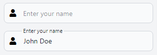

# ShadowFloatingLabels


ShadowFloatingLabels is a lightweight (1.25ko gzip), versatile JavaScript library designed to enhance form usability by transforming placeholders into floating labels using the Shadow DOM.

It seamlessly integrates with any HTML structure and CSS framework, ensuring a smooth and visually appealing user experience across all web applications.



## Features

- Lightweight and easy to integrate.
- Utilizes the Shadow DOM for encapsulation.
- Compatible with all major CSS frameworks.
- Enhances form usability and aesthetics.

## Getting Started

To get started with ShadowFloatingLabels, include the `ShadowFloatingLabels.min.js` in your project.

```html
<script src="path/to/ShadowFloatingLabels.min.js"></script>
```

### Initialize Shadow Floating Labels

You can initialize ShadowFloatingLabels with or without a custom selector. By default, it targets all `input` and `textarea` elements inside elements with the `.floating-labels` class.

- **Without a custom selector:**

```html
<script>
    document.addEventListener('DOMContentLoaded', function () {
        const shadowFloatingLabels = new ShadowFloatingLabels();
    });
</script>
```

- **With a custom selector:**

  To initialize with a custom selector, pass the selector string as an argument to the `ShadowFloatingLabels` constructor.

```html
<script>
    document.addEventListener('DOMContentLoaded', function () {
        const shadowFloatingLabels = new ShadowFloatingLabels('.custom-selector');
    });
</script>
```

## Methods

### `refreshFields(selector)`
Refreshes the floating labels for the specified input fields. This is useful when you dynamically add inputs to the DOM and want to apply floating labels to them.

`selector` (string): The CSS selector for the input field(s) to refresh.

```javascript
shadowFloatingLabels.refreshFields('input[name="searchInput"]');
```

### `refresh`
Refreshes all floating labels on the page. This method is useful when the state of the inputs changes and you need to reapply the floating label styles.

```javascript
shadowFloatingLabels.refresh();
```

## Demos

Experience ShadowFloatingLabels in action with our demos tailored for popular CSS frameworks:

[https://shadow-floating-labels.miglisoft.com/](https://shadow-floating-labels.miglisoft.com/)

## License

ShadowFloatingLabels is open-source software licensed under the GNU General Public License v3.0. For more details, see the [LICENSE](LICENSE) file.

## Contributing

Contributions are welcome! Please read our contributing guidelines to get started.

## Support

If you encounter any issues or have questions, please file an issue on the project's GitHub issue tracker.
